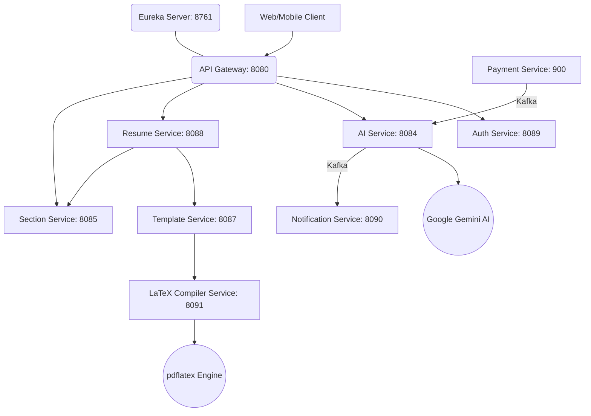

<div align="center">
  
# 🚀 AI-Powered Resume Builder & ATS Analyzer

[](https://www.oracle.com/java/)
[](https://spring.io/projects/spring-boot)
[](#-architecture)
[](https://kafka.apache.org/)
[](LICENSE)

An enterprise-grade, highly scalable microservices platform designed to help job seekers build pixel-perfect professional resumes, analyze them using **Google's Gemini AI**, and calculate real-time **ATS (Applicant Tracking System)** scores to land top-tier jobs.

[Explore the Docs](#-api-documentation) · [Report Bug](https://github.com/Akshat-Jain02/AI-Powered-Resume-Builder-Backend/issues) · [Request Feature](https://github.com/Akshat-Jain02/AI-Powered-Resume-Builder-Backend/issues)

</div>

---

## 🌟 Key Features

* **🤖 Advanced AI Analysis:** Leverages Google Gemini AI to analyze resumes, offering tailored keyword suggestions, strength identification, and actionable feedback.
* **📈 Real-Time ATS Scoring:** Predicts how well a resume matches target job descriptions against top applicant tracking systems.
* **📄 Pixel-Perfect PDF Generation:** Uses enterprise-grade **LaTeX** engine (`pdflatex`) to render immaculate, highly customizable resumes dynamically.
* **🔐 Robust Security:** Centralized API Gateway with role-based access control (RBAC), JWT authentication, and OAuth2 social login (GitHub/Google).
* **💳 Integrated Credit System:** Scalable pay-per-analysis model integrated with Razorpay.
* **🏗️ Event-Driven Architecture:** Asynchronous, non-blocking communication via Apache Kafka for high-performance notification delivery and background tasks.

---

## 🏗 Architecture Overview

The system implements a robust distributed microservices architecture using **Spring Cloud** for seamless service discovery, routing, and load balancing.



---

## 📋 Microservices Registry

Our ecosystem consists of specialized, independently scalable microservices:

| Service | Port | Primary Responsibility | Key Technologies |
| :--- | :---: | :--- | :--- |
| **🌐 Eureka Server** | `8761` | Service registration, discovery, and health monitoring. | Spring Cloud Netflix Eureka |
| **🚪 API Gateway** | `8080` | Central entry point, Auth verification, routing, rate limiting, and API Docs aggregation. | Spring Cloud Gateway, JWT |
| **🛡️ Auth Service** | `8089` | User identity management, OAuth2 (GitHub/Google), and JWT issuance. | Spring Security, OAuth2 |
| **🧠 AI Service** | `8084` | Resume analysis, tailoring suggestions, and ATS scoring engine. | Gemini SDK, Spring AI |
| **📄 Resume Service** | `8088` | Core resume CRUD operations and PDF generation orchestration. | Feign Clients, MySQL |
| **📑 Section Service** | `8085` | Specialized resume section data management and JSON parsing. | JPA, MySQL |
| **🔔 Notification Svc**| `8090` | Real-time email alerts for completed analyses and successful payments. | Apache Kafka, JavaMail |
| **💳 Payment Service** | `900` | User credit management and Razorpay payment gateway integration. | Razorpay SDK, Kafka |
| **💼 Job Service** | `8086` | Target job description storage, parsing, and matching logic. | JPA, MySQL |
| **🎨 Template Svc** | `8087` | Dynamic LaTeX-based PDF template generation and Cloudinary asset management. | LaTeX, pdflatex, MySQL |
| **📝 LaTeX Compiler** | `8091` | Dedicated microservice for processing and compiling LaTeX to PDF securely. | pdflatex, Spring Boot |

---

## 🛠 Tech Stack

### Backend


### Databases & Messaging


### Tooling & DevOps


---

## 🚀 Getting Started

### Prerequisites
Before you begin, ensure you have the following installed:
- **Java 21 or higher** (JDK 25 recommended)
- **Maven 3.8+**
- **MySQL 8.x**
- **Apache Kafka** (Zookeeper or KRaft mode)
- **LaTeX Distribution**: A working `pdflatex` installation (e.g., MiKTeX for Windows, TeX Live for Linux/Mac).
- **API Keys**: Google Gemini API Key, Razorpay Credentials, Cloudinary Credentials.

### ⚙️ Local Environment Setup

1. **Clone the repository**
   ```bash
   git clone https://github.com/Akshat-Jain02/AI-Powered-Resume-Builder-Backend.git
   cd AI-Powered-Resume-Builder-Backend
   ```

2. **Configure Environment Variables**
   Update `application.properties` in the respective microservices to match your local database credentials and insert your API keys (Gemini, Razorpay, Cloudinary, JWT Secret).

3. **Start the Infrastructure**
   Ensure your local MySQL server and Apache Kafka brokers are running.

4. **Launch all Microservices**
   We have provided utility scripts to start all microservices seamlessly.

   **Windows**:
   ```bash
   .\start-all.bat
   ```

   **Linux/Mac**:
   ```bash
   sh ./start-all.sh
   ```

*(Note: Ensure you start the `eureka-server` and `api-gateway` first if starting manually).*

---

## 🔗 API Documentation

This project utilizes **OpenAPI 3.0** to provide interactive API documentation. The API Gateway centralizes the documentation for all underlying microservices.

Once the services are running, access the global Swagger UI at:
👉 **[http://localhost:8080/swagger-ui.html](http://localhost:8080/swagger-ui.html)**

---

## 🧪 Testing & Quality Assurance

The project maintains strict quality gates enforcing >80% test coverage across all modules.

To execute the test suite and generate JaCoCo coverage reports:
```bash
.\verify-all.bat
```

To run SonarQube analysis (ensure local SonarQube server is running on port 9000):
```bash
mvn clean verify sonar:sonar
```

---

## 👨‍💻 Author

**Akshat Jain**  
*Full Stack Developer & Software Engineer*
- GitHub: [@Akshat-Jain02](https://github.com/Akshat-Jain02)

---

<div align="center">
  <i>If you found this project helpful, please consider giving it a ⭐️!</i>
</div>
