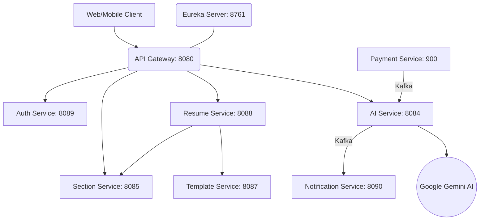

# 🚀 AI-Powered Resume Builder & ATS Analyzer

[](https://www.oracle.com/java/)
[](https://spring.io/projects/spring-boot)
[](#-architecture)
[](LICENSE)

An enterprise-grade, microservices-based platform designed to help job seekers build professional resumes, analyze them using Google's Gemini AI, and calculate real-time ATS (Applicant Tracking System) scores.

---

## 🏗 Architecture Overview

The system is built on a distributed microservices architecture using **Spring Cloud** for service discovery and routing, **Kafka** for event-driven processing, and **Gemini AI** for intelligent text analysis.

### 🧩 Logic Flow


---

## 📋 Microservices Registry

| Service Name | Port | Primary Responsibility | Key Technologies |
|:---|:---:|:---|:---|
| **Eureka Server** | `8761` | Service registration and health discovery | Spring Cloud Netflix |
| **API Gateway** | `8080` | Central entry point, Auth verification, API Docs aggregation | Spring Cloud Gateway, Jwt |
| **Auth Service** | `8089` | User identity, OAuth2 (GitHub/Google), JWT issuance | Spring Security, OAuth2 |
| **AI Service** | `8084` | Resume analysis, tailoring suggestions, ATS scoring | Gemini SDK, Spring AI |
| **Resume Service** | `8088` | Core resume CRUD, PDF generation orchestration | Feign, MySQL |
| **Section Service** | `8085` | Specialized resume section management and parsing | JPA, MySQL |
| **Notification Svc**| `8090` | Real-time email alerts for analysis and payments | Kafka, JavaMail |
| **Payment Service** | `900` | Credit management and Razorpay integration | Razorpay SDK, Kafka |
| **Job Service** | `8086` | Job description storage and matching logic | JPA, MySQL |
| **Template Svc** | `8087` | HTML-to-PDF dynamic template rendering | Thymeleaf, OpenPDF |

---

## ✨ Core Features

- **🤖 AI Resume Analysis**: Leverages Google Gemini to provide strengths, weaknesses, and keyword suggestions.
- **📈 ATS Scoring**: Calculates how well a resume matches job descriptions for top-tier companies.
- **📄 Pro Templates**: Dynamic PDF generation with multiple professional templates.
- **🔐 Secure Auth**: Role-based access control and social login.
- **💳 Credit System**: Pay-per-analysis model integrated with Razorpay.
- **🏗 Event-Driven**: Asynchronous notification delivery via Kafka for smooth UX.

---

## 🛠 Tech Stack

- **Backend**: Java 25, Spring Boot 3.x
- **Database**: MySQL, Hibernate/JPA
- **Messaging**: Apache Kafka
- **Security**: Spring Security, JWT, OAuth2
- **Documentation**: OpenAPI 3.0 (Swagger UI) centralized via Gateway
- **DevOps**: SonarQube, JaCoCo, Maven Wrapper

---

## 🚀 Getting Started

### Prerequisites
- **Java 25** (Minimum Java 21)
- **Maven 3.x**
- **MySQL 8.x**
- **Apache Kafka** (Zookeeper/Kraft)
- **Gemini API Key** (Set in AI Service/Environment)

### Environment Setup
1. Clone the repository: `git clone https://github.com/Akshat-Jain02/AI-Powered-Resume-Builder-Backend.git`
2. Configure your `application.properties` with database and API keys.
3. Run the automated startup scripts:

**Windows**:
```bash
./start-all.bat
```

**Linux/Mac**:
```bash
sh ./start-all.sh
```

---

## 🔗 API Documentation
Once the gateway is running, you can access the centralized Swagger UI for all services at:
`http://localhost:8080/swagger-ui.html`

---

## 👨‍💻 Author
**Akshat Jain**  
*Full Stack Developer*

---
© 2024 AI-Powered Resume Builder Project
